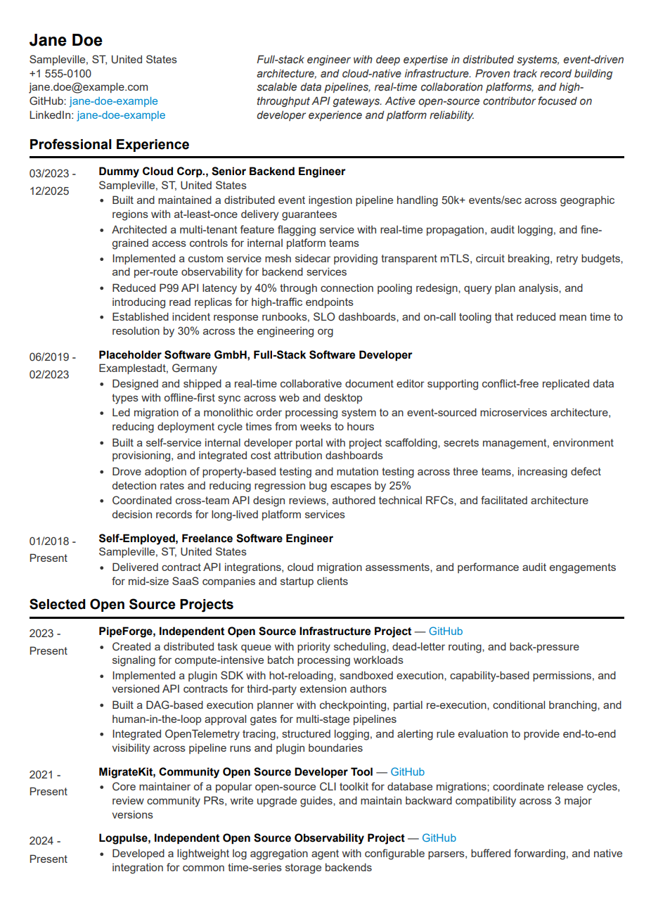

# CV Template (Markdown + SCSS + VS Code Dev Container)

A clean, single or double-page CV template written in Markdown with embedded HTML layout, styled with SCSS, and rendered via [Markdown Preview Enhanced](https://shd101wyy.github.io/markdown-preview-enhanced/). Designed to run inside a Dev Container with all tooling pre-configured.



## Prerequisites

- [Docker](https://www.docker.com/get-started) installed and running
- [Visual Studio Code](https://code.visualstudio.com/) with the [Dev Containers](https://marketplace.visualstudio.com/items?itemName=ms-vscode-remote.remote-containers) extension installed
- Web browser with PDF printing capabilities (e.g., Chrome, Firefox, Edge), tested on Brave / Chromium-based browsers for best results

## Quick Start

1. Click the **Use this template** button at the top of the repository page on GitHub, then select **Create a new repository**. Fill in your repository name and clone your new repo locally:

   ```sh
   git clone <your-new-repository-url>
   cd <your-repo-name>
   code .
   ```

2. When prompted, select **Reopen in Container** (or run `Dev Containers: Reopen in Container` from the command palette). This builds the container and installs all required extensions automatically.

3. Once the container is running, compile the SCSS stylesheet to LESS. Open `.crossnote/style.scss` and either:
   - Press `Ctrl+Alt+S` to trigger the Live Sass Compiler manually, or
   - Open the command palette (`F1`) and run **Live Sass: Compile Current File** while `style.scss` is open

   This generates `.crossnote/style.less`, which is gitignored and must be compiled at least once after a fresh clone.

4. Open `cv-template-en_us.md`.

5. Open the Markdown Preview Enhanced panel: right-click the editor and select **Markdown Preview Enhanced: Open Preview to the Side** (or press `Ctrl+K V`). You should see a fully formatted CV in the preview pane.

6. Export the preview to HTML so it can be served in the browser:
   - Right-click the Markdown Preview Enhanced pane
   - Select **Export > HTML > HTML (cdn hosted)**

   This generates the HTML file next to the Markdown source with all assets linked to public CDNs. The HTML export is gitignored and must be regenerated after every change.

7. Open `http://localhost:8080` in your browser (VS Code may show a port-forwarding notification). The Dev Container runs a simple HTTP server on port 8080 that serves the workspace directory.

## Included Extensions

The Dev Container installs the following VS Code extensions:

| Extension | Purpose |
|-----------|---------|
| **Markdown Preview Enhanced** | Renders the Markdown source with full CSS styling, KaTeX math, and HTML export |
| **Live Sass Compiler** | Compiles `.crossnote/style.scss` to `.crossnote/style.less` on demand or on save |
| **GitHub Copilot** | AI-assisted editing (optional, requires authentication) |

**Live Sass Compiler** does not necessarily start automatically. After a fresh clone, you must trigger compilation at least once (`Ctrl+Alt+S` or via the command palette as described above). Once activated, the extension will recompile on subsequent saves of `style.scss` for the duration of the session. The generated `.less` file is gitignored and will not be present until you compile.

## Editing the Template

### Replacing Sample Data

Open `cv-template-en_us.md` and replace the placeholder content in each section:

- **Header** — Name, city, phone, email, GitHub URL, LinkedIn URL
- **Professional Summary** — A concise paragraph (2–3 sentences) tailored to your target role
- **Professional Experience** — Positions listed in reverse chronological order with bullet points
- **Open Source Projects** — Notable projects with repository links and short descriptions
- **Education** — Degrees, institutions, GPA, thesis title, awards
- **Skills & Technologies** — Categorized lists of languages, frameworks, databases, and tools

Dates use `MM/YYYY` format. The preview updates live as you type.

### Adding a New Section

Sections follow a consistent pattern. To add one, insert a new `.section` div after the last existing one:

```html
<div class="section">

#### Section Title

<div class="time-list">
<div>MM/YYYY - MM/YYYY</div>
<div>

**Entry Title**  
Location
- Bullet point describing the entry

</div>
</div>
</div>
```

For sections without dates (like Skills), use the `.label-grid` layout instead:

```html
<div class="section">

#### Section Title

<div class="label-grid">
<div>Category:</div>
<div>Item 1, Item 2, Item 3</div>
</div>
</div>
```

### Page Breaks

Add the `pagebreak` class to a `.section` div to force a page break before it in the PDF output:

```html
<div class="section pagebreak">
```

## Styling

All layout and typography is defined in `.crossnote/style.scss`. After editing, recompile with `Ctrl+Alt+S` (or via the command palette) to regenerate `style.less`. The preview picks up the updated LESS file on the next refresh.

Key SCSS structure:

| Selector / Class | Purpose |
|------------------|---------|
| `.cv` | Root flex container for the entire document |
| `.header` | Top row: name/contact on the left, professional summary on the right |
| `.professional-summary` | Right-aligned summary block (61.8% width) |
| `.section` | Vertical section block with a bold underlined `h4` heading |
| `.time-list` | Two-column flex layout pairing date ranges with content blocks |
| `.label-grid` | Two-column CSS grid for categorized skill lists |
| `.pagebreak` | Triggers `page-break-before: always` for PDF/print output |

To adjust fonts, spacing, colors, or margins, edit `style.scss` and recompile. Both `style.less` and the HTML export are gitignored — they must be regenerated locally after every fresh clone or style change.

## Exporting to PDF

The full workflow from edit to PDF:

1. **Compile SCSS** — Press `Ctrl+Alt+S` (or command palette > **Live Sass: Compile Current File**) to generate the up-to-date `style.less`.

2. **Export HTML** — Right-click the Markdown Preview Enhanced pane and select **HTML > HTML (cdn hosted)**. This writes the HTML file next to the Markdown source with all assets linked to public CDNs. The HTML export is gitignored and must be regenerated every time you change the template or styles.

3. **Preview in browser** — Open `http://localhost:8080` (the Dev Container forwards this port automatically). The HTML export is self-contained with CDN-hosted assets, so it renders correctly in any browser.

4. **Print to PDF** — In the browser, press `Ctrl+P` / `Cmd+P` and select **Save as PDF** as the destination. Recommended print settings:
   - Margins: None (or Minimum)
   - Scale: 100%
   - Background graphics: Enabled

   The stylesheet includes `print-color-adjust: exact` to preserve colors, and the `.pagebreak` class controls pagination.

## Project Structure

```
.
├── .crossnote/
│   ├── config.js          # Markdown Preview Enhanced configuration
│   ├── head.html          # Custom <head> content injected into previews
│   ├── parser.js          # Custom parser hooks
│   ├── style.scss         # Primary stylesheet (edit this)
│   └── style.less         # Compiled output (gitignored, generated via Live Sass)
├── .devcontainer/
│   ├── devcontainer.json  # Container definition and extension list
│   ├── docker-compose.yml # Service configuration
│   └── Dockerfile         # Base image and dependencies
├── cv-template-en_us.md   # The CV template source (edit this)
├── cv-template-en_us.html # HTML export (gitignored, generated via MPE)
├── LICENSE                # MIT
└── README.md
```

## License

MIT. See [LICENSE](LICENSE) for details.
